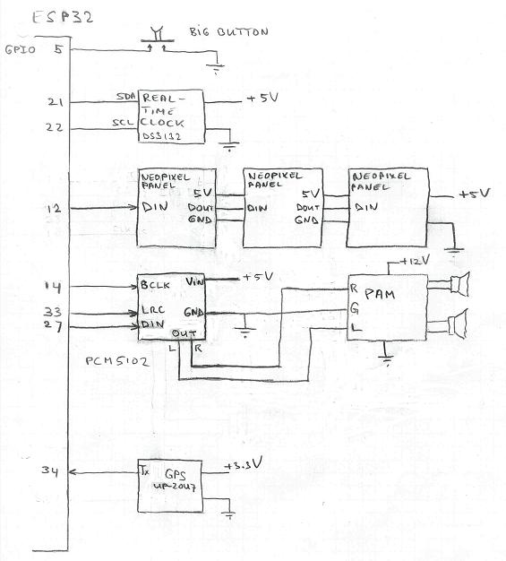

# Hahaho Interactive Pole
The Interactive Pole is a standalone fun device that can be positioned in supervisioned public spaces. It features an activation button, various sensors, loudspeakers and several lighting and display options. The pole as displayed below originated from a project for the Amsterdam Police, carried out by one of the members of the Hahaho Foundation. 


The joined membership of the Hahaho Foundation feels that the remaining prototypes can serve for applications with a higher fun factor and we will use the interactive pole as a project in which people of all skill-levels can participate. If you live near Utrecht and want to see the pole in action, check our [website](https://hahaho-makers.nl/) for our biweekly meetings.



The figure above provides a schematic overview of the entire system (from the [detailed documentation](https://github.com/hadoopmarc/hahaho-interactive-pole/blob/main/inspiration/doc/HIP.pdf)). The table below shows the connections between the various components and the ESP32 dev board.

```c
//***************************************************************************************************
// Wiring.                                                                                          *
// ------------------------------------------------------------------------------------------------ *
// ESP32dev Signal  Connected to                Remarks                                             *
// -------- ------  --------------              ----------------------------------------------      *
// GPIO0    BOOT    Reserved bootloader         Also 2nd start button for test                      *
// GPIO1    TXD0    Reserved serial output                                                          *
// GPIO2            Built-in LED                                                                    *
// GPI03    RXD0    Reserved serial input                                                           *
// GPIO4            -                                                                               *
// GPIO5            Big button                  (active low)                                        *
// GPIO12           Neopixel panel DIN                                                              *
// GPIO14           I2S BCLK naar bijv. MAX98357A / PCM5102                                         *
// GPIO15           -                                                                               *
// GPIO16   RXD2    -                                                                               *
// GPIO17   TXD2    -                                                                               *
// GPIO18   SCK     -                                                                               *
// GPIO19   MISO    -                                                                               *
// GPIO21           SDA for I2C (DS3132)                                                            *
// GPIO22           SCK for I2C (DS3132)                                                            *
// GPIO23   MOSI    -                                                                               *
// GPIO25   -       audio output van interne DAC.                                                   *
// GPIO26   -       audio output van interne DAC.                                                   *
// GPIO27   -       I2S DIN  naar bijv. MAX98357A / PCM5102                                         *
// GPIO32   -       Enable VIN of PCM5102                                                           *
// GPIO33   -       I2S LRC  naar bijv. MAX98357A / PCM5102                                         *
// GPIO34   -       GPS TX                      (input only pin)                                    *
// GPIO35   -       -                           (input only pin)                                    *
// -------  ------  ----------------                                                                *
// GND      -       Power supply GND                                                                *
// VCC 5 V  -       Power supply                                                                    *
// VCC 5 V  -       Power supply                                                                    *
// 3.3 V    -       GPS Vcc                                                                         *
// EN       -       -                                                                               *
//***************************************************************************************************
```
