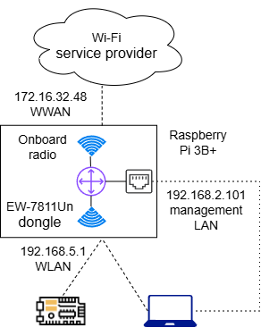

# A Raspberry Pi travel router for publicroam.nl

The [Makey Mondays in Utrecht](https://www.meetup.com/hahaho-sharingtechnology-innovative-tech-meetings/events/?type=past),
The Netherlands, have a special requirement
on the use of the [publicroam.nl](https://publicroam.nl/en/) Wi-Fi network.
Participants should be able to connect to the internet through publicroam.nl and at
the same time be able to perform OTA (over the air) firmware upgrades to simple
microcontrollers like the
[ESP32](https://www.espressif.com/en/products/socs/esp32). However, it is not easy to
make such microcontrollers connect with publicroam.nl, because it requires
authentication with the
[PEAP/EAP-MSCHAPV2 protocol](https://en.wikipedia.org/wiki/Protected_Extensible_Authentication_Protocol). This
protocol on its turn requires several libraries that take a lot of
the scarce resources of a simple microcontroller. Therefore, it is more
attractive to use an additional wireless router that connects to publicroam.nl and
serves as a simple secure Wi-Fi access point with a second radio, see
the figure below. This blog post details how this was realized using an old
[Raspberry Pi](https://www.raspberrypi.com/) configured with
[OpenWrt](https://openwrt.org/) routing firmware.



It can be noted that this setup is identical to that of a travel router, which is
often used to act as a protective shield when using untrusted hotel Wi-Fi networks.
In fact, OpenWRT has the `Travelmate` extension package to easily make available
known configurations to public Wi-Fi service providers. However, the publicroam.nl
configuration does not seem to easily fit in this framework, as I could not find
any references to it. Therefore, the exploration towards the proper configuration
for publicroam.nl was done without `Travelmate`.

Looking back, the main hurdle encountered was to give the OpenWrt `wpad` package
access to the [publicroam.nl certificate](https://publicroam.nl/certificate-latest)
for the IEEE 802.1x authentication that is part of the MSCHAPV2 protocol. The [LuCI
webui](https://openwrt.org/docs/guide-user/luci/start) to OpenWrt suggests that
uploading the certificate with LuCI should suffice, but this turned out to fail.
This was followed by a number of random attempts with different versions of the
`wpad` package and different ways to install the certificate, until I hit upon
a working configuration. Because of my limited knowledge of OpenWrt, linux and
certificate chains, I have not tried to simplify the resulting configuration or
pinpoint any issues in OpenWrt. I figured, though, that the literal documentation
of the resulting configuration could be of help to other users and here it is!

Without detailing steps documented elsewhere, the setup described can be
realized as follows:
- be sure that you use a solid 5V/3A power supply for the RPi, because the power
drawn by an additional radio can easily result in brownout situations (RPi gets
in a reboot loop). To be on the safe side, radio transmit power in the configurations
below is limited to 10 mW
- burn the OpenWrt firmware on the RPi's SD-card as described
[here](https://openwrt.org/toh/raspberry_pi_foundation/raspberry_pi)
- get [SSH access to OpenWrt](https://openwrt.org/docs/guide-quick-start/sshadministration)
from your laptop
- using LuCI temporarily connect to your private Wi-Fi network for internet access
- using LuCI install the following OpenWrt pacakages: ca-bundle, kmod-rtl8192cu,
openssh-sftp-server, openssl-util, rtl8192cu-firmware, wpa-cli, wpad-openssl
- insert a Wi-Fi USB dongle as a second radio (the rtl8192cu packages installed
above are required for the prevalent EW-7811Un dongle)
- copy the config files detailed below to /etc/config, e.g. using winscp (after
editing credentials and network names)
- copy the downloaded
[publicroam Wi-Fi certificate](https://publicroam.nl/certificate-latest) to /etc/ssl/certs
- get a terminal in the RPi with ssh or Putty and run the command `openssl rehash`
- reboot the RPi and you should be able to connect to the configured SSID using
the configured password. In a publicroam environment the system logs in LuCI should
indicate a valid connection to publicroam (see the end of this post for example
logs).

Hardware: Raspberry Pi 3B+ with EW-7811Un from Edimax \
Firmware: openwrt-24.10.2-bcm27xx-bcm2710-rpi-3-squashfs-sysupgrade.img.gz

/etc/config/network
```
config interface 'loopback'
	option device 'lo'
	option proto 'static'
	option ipaddr '127.0.0.1'
	option netmask '255.0.0.0'

config device
	option name 'br-lan'
	option type 'bridge'
	list ports 'eth0'

config interface 'lan'
	option device 'br-lan'
	option proto 'dhcp'

config interface 'wlan_hahaho'
	option proto 'static'
	option ipaddr '192.168.5.1'
	option netmask '255.255.255.0'
	option device 'phy0-ap0'

config interface 'wwan_pubroam'
	option proto 'dhcp'
	option device 'radio0.network1'
```
 /etc/config/wireless
```
config wifi-device 'radio0'
	option type 'mac80211'
	option path 'platform/soc/3f300000.mmcnr/mmc_host/mmc1/mmc1:0001/mmc1:0001:1'
	option channel 'auto'
	option band '5g'
	option htmode 'VHT20'
	option cell_density '0'
	option log_level '0'
	option txpower '10'

config wifi-iface 'default_radio0'
	option device 'radio0'
	option mode 'sta'
	option encryption 'wpa2'
	option network 'wwan_pubroam'
	option ssid 'publicroam'
	option log_level '0'
	option eap_type 'peap'
	option auth 'EAP-MSCHAPV2'
	option identity 'publicroam-username'
	option password 'publicroam-password'
	option anonymous_identity 'anonymous'
	option ieee80211w '1'
	option ca_cert_usesystem '1'

config wifi-device 'radio1'
	option type 'mac80211'
	option path 'platform/soc/3f980000.usb/usb1/1-1/1-1.2/1-1.2:1.0'
	option channel '9'
	option band '2g'
	option htmode 'HT20'
	option cell_density '0'
	option log_level '1'
	option txpower '10'

config wifi-iface 'default_radio1'
	option device 'radio1'
	option mode 'ap'
	option ssid 'offered-wifi-ssid'
	option key 'offered-wifi-password'
	option encryption 'psk2'
	option network 'wlan_hahaho'
	option log_level '1'
```

/etc/config/firewall
```
config defaults
	option input 'REJECT'
	option output 'ACCEPT'
	option forward 'REJECT'

config zone
	option name 'lan'
	option input 'ACCEPT'
	option output 'ACCEPT'
	option forward 'ACCEPT'
	list network 'lan'
	option masq '1'

config zone
	option name 'lan_wlan'
	option input 'ACCEPT'
	option output 'ACCEPT'
	option forward 'ACCEPT'
	list network 'wlan_hahaho'
	option masq '1'

config forwarding
	option src 'lan_wlan'
	option dest 'lan'

config zone
	option name 'wwan_pubr'
	option input 'ACCEPT'
	option output 'ACCEPT'
	option forward 'ACCEPT'
	list network 'wwan_pubroam'
	option masq '1'

config forwarding
	option src 'lan_wlan'
	option dest 'wwan_pubr'

config forwarding
	option src 'wwan_pubr'
	option dest 'lan_wlan'
```

/etc/config/dhcp
```
config dnsmasq
	option domainneeded '1'
	option localise_queries '1'
	option rebind_protection '1'
	option rebind_localhost '1'
	option local '/lan/'
	option domain 'lan'
	option expandhosts '1'
	option cachesize '1000'
	option authoritative '1'
	option readethers '1'
	option leasefile '/tmp/dhcp.leases'
	option resolvfile '/tmp/resolv.conf.d/resolv.conf.auto'
	option localservice '1'
	option ednspacket_max '1232'
	list interface 'wlan_hahaho'
	list notinterface 'lan'

config dhcp 'lan'
	option interface 'lan'
	option start '100'
	option limit '150'
	option leasetime '12h'
	option dhcpv4 'server'
	option dhcpv6 'hybrid'
	option ra 'hybrid'
	list ra_flags 'managed-config'
	list ra_flags 'other-config'
	option ignore '1'

config dhcp 'wan'
	option interface 'wan'
	option ignore '1'

config odhcpd 'odhcpd'
	option maindhcp '0'
	option leasefile '/tmp/hosts/odhcpd'
	option leasetrigger '/usr/sbin/odhcpd-update'
	option loglevel '4'

config dhcp 'wlan_hahaho'
	option interface 'wlan_hahaho'
	option start '100'
	option limit '150'
	option leasetime '12h'
	option force '1'
```

Syslogs related to establishing the wireless interfaces
```
Sat Sep  6 14:51:18 2025 daemon.notice netifd: Interface 'wlan_hahaho' is enabled
Sat Sep  6 14:51:18 2025 daemon.notice netifd: Interface 'wlan_hahaho' is setting up now
Sat Sep  6 14:51:18 2025 daemon.notice wpa_supplicant[814]: phy1-sta0: Trying to associate with 34:85:84:4e:e7:a5 (SSID='publicroam' freq=5220 MHz)
Sat Sep  6 14:51:18 2025 daemon.notice netifd: Interface 'wlan_hahaho' is now up
Sat Sep  6 14:51:18 2025 kern.info kernel: [   14.595441] rtl8192cu: MAC auto ON okay!
Sat Sep  6 14:51:19 2025 kern.info kernel: [   14.643075] rtl8192cu: Tx queue select: 0x05
Sat Sep  6 14:51:19 2025 user.notice firewall: Reloading firewall due to ifup of wlan_hahaho (phy0-ap0)
Sat Sep  6 14:51:20 2025 daemon.notice netifd: Network device 'phy0-ap0' link is up
Sat Sep  6 14:51:20 2025 daemon.notice netifd: Interface 'wlan_hahaho' has link connectivity
Sat Sep  6 14:51:20 2025 kern.info kernel: [   16.118173] IPv6: ADDRCONF(NETDEV_CHANGE): phy0-ap0: link becomes ready
Sat Sep  6 14:51:20 2025 daemon.notice netifd: Network device 'phy1-sta0' link is up
Sat Sep  6 14:51:20 2025 daemon.notice netifd: Interface 'wwan_pubroam' has link connectivity
Sat Sep  6 14:51:20 2025 daemon.notice netifd: Interface 'wwan_pubroam' is setting up now
Sat Sep  6 14:51:20 2025 daemon.notice wpa_supplicant[814]: phy1-sta0: Associated with 34:85:84:4e:e7:a5
Sat Sep  6 14:51:20 2025 daemon.notice wpa_supplicant[814]: phy1-sta0: CTRL-EVENT-EAP-STARTED EAP authentication started
Sat Sep  6 14:51:20 2025 daemon.notice wpa_supplicant[814]: phy1-sta0: CTRL-EVENT-SUBNET-STATUS-UPDATE status=0
Sat Sep  6 14:51:20 2025 daemon.notice wpa_supplicant[814]: phy1-sta0: CTRL-EVENT-EAP-PROPOSED-METHOD vendor=0 method=25
Sat Sep  6 14:51:20 2025 daemon.notice netifd: wwan_pubroam (1981): udhcpc: started, v1.36.1
Sat Sep  6 14:51:20 2025 daemon.notice hostapd: phy0-ap0: interface state UNINITIALIZED->ENABLED
Sat Sep  6 14:51:20 2025 daemon.notice hostapd: phy0-ap0: AP-ENABLED
Sat Sep  6 14:51:20 2025 daemon.notice netifd: wwan_pubroam (1981): udhcpc: broadcasting discover
Sat Sep  6 14:51:20 2025 daemon.info dnsmasq[1]: exiting on receipt of SIGTERM
Sat Sep  6 14:51:21 2025 daemon.notice wpa_supplicant[814]: phy1-sta0: CTRL-EVENT-EAP-METHOD EAP vendor 0 method 25 (PEAP) selected
Sat Sep  6 14:51:21 2025 daemon.notice wpa_supplicant[814]: phy1-sta0: CTRL-EVENT-EAP-PEER-CERT depth=2 subject='/C=US/ST=New Jersey/L=Jersey City/O=The USERTRUST Network/CN=USERTrust RSA Certification Authority' hash=e793c9b02fd8aa13e21c31228accb08119643b749c898964b1746d46c3d4cbd2
Sat Sep  6 14:51:21 2025 daemon.notice wpa_supplicant[814]: phy1-sta0: CTRL-EVENT-EAP-PEER-CERT depth=1 subject='/C=GB/ST=Greater Manchester/L=Salford/O=Sectigo Limited/CN=Sectigo RSA Extended Validation Secure Server CA' hash=57d8bdcd58955a5590a57c6aafa581ed9b96bed76fafee969b139187c5a872c7
Sat Sep  6 14:51:21 2025 daemon.notice wpa_supplicant[814]: phy1-sta0: CTRL-EVENT-EAP-PEER-CERT depth=0 subject='/serialNumber=70318433/jurisdictionC=NL/businessCategory=Private Organization/C=NL/ST=Utrecht/O=Publicroam B.V./CN=publicroam.nl' hash=64459d5bf4f035bb004e980e79780af84c6cb09fef64a95070dd25f247a9e276
Sat Sep  6 14:51:21 2025 daemon.notice wpa_supplicant[814]: phy1-sta0: CTRL-EVENT-EAP-PEER-ALT depth=0 DNS:publicroam.nl
Sat Sep  6 14:51:21 2025 daemon.notice wpa_supplicant[814]: phy1-sta0: CTRL-EVENT-EAP-PEER-ALT depth=0 DNS:www.publicroam.nl
Sat Sep  6 14:51:21 2025 daemon.notice netifd: Wireless device 'radio1' is now up
Sat Sep  6 14:51:21 2025 daemon.notice wpa_supplicant[814]: EAP-MSCHAPV2: Authentication succeeded
Sat Sep  6 14:51:21 2025 daemon.notice wpa_supplicant[814]: EAP-TLV: TLV Result - Success - EAP-TLV/Phase2 Completed
Sat Sep  6 14:51:21 2025 daemon.notice wpa_supplicant[814]: phy1-sta0: CTRL-EVENT-EAP-SUCCESS EAP authentication completed successfully
Sat Sep  6 14:51:21 2025 daemon.notice wpa_supplicant[814]: phy1-sta0: PMKSA-CACHE-ADDED 34:85:84:4e:e7:a5 0
Sat Sep  6 14:51:21 2025 daemon.notice wpa_supplicant[814]: phy1-sta0: WPA: Key negotiation completed with 34:85:84:4e:e7:a5 [PTK=CCMP GTK=CCMP]
Sat Sep  6 14:51:21 2025 daemon.notice wpa_supplicant[814]: phy1-sta0: CTRL-EVENT-CONNECTED - Connection to 34:85:84:4e:e7:a5 completed [id=0 id_str=]
Sat Sep  6 14:51:21 2025 kern.info kernel: [   16.922658] IPv6: ADDRCONF(NETDEV_CHANGE): phy1-sta0: link becomes ready
Sat Sep  6 14:51:21 2025 daemon.info dnsmasq[1]: started, version 2.90 cachesize 1000
Sat Sep  6 14:51:21 2025 daemon.info dnsmasq[1]: compile time options: IPv6 GNU-getopt no-DBus UBus no-i18n no-IDN DHCP no-DHCPv6 no-Lua TFTP no-conntrack no-ipset no-nftset no-auth no-cryptohash no-DNSSEC no-ID loop-detect inotify dumpfile
Sat Sep  6 14:51:21 2025 daemon.info dnsmasq[1]: UBus support enabled: connected to system bus
Sat Sep  6 14:51:21 2025 daemon.info dnsmasq-dhcp[1]: DHCP, IP range 192.168.5.100 -- 192.168.5.249, lease time 12h
Sat Sep  6 14:51:21 2025 daemon.info dnsmasq-dhcp[1]: DHCP, sockets bound exclusively to interface phy0-ap0
Sat Sep  6 14:51:21 2025 daemon.info dnsmasq[1]: using only locally-known addresses for test
Sat Sep  6 14:51:21 2025 daemon.info dnsmasq[1]: using only locally-known addresses for onion
Sat Sep  6 14:51:21 2025 daemon.info dnsmasq[1]: using only locally-known addresses for localhost
Sat Sep  6 14:51:21 2025 daemon.info dnsmasq[1]: using only locally-known addresses for local
Sat Sep  6 14:51:21 2025 daemon.info dnsmasq[1]: using only locally-known addresses for invalid
Sat Sep  6 14:51:21 2025 daemon.info dnsmasq[1]: using only locally-known addresses for bind
Sat Sep  6 14:51:21 2025 daemon.info dnsmasq[1]: using only locally-known addresses for lan
Sat Sep  6 14:51:21 2025 daemon.warn dnsmasq[1]: no servers found in /tmp/resolv.conf.d/resolv.conf.auto, will retry
Sat Sep  6 14:51:21 2025 daemon.info dnsmasq[1]: read /etc/hosts - 12 names
Sat Sep  6 14:51:21 2025 daemon.info dnsmasq[1]: read /tmp/hosts/dhcp.cfg01411c - 2 names
Sat Sep  6 14:51:21 2025 daemon.info dnsmasq-dhcp[1]: read /etc/ethers - 0 addresses
Sat Sep  6 14:51:24 2025 daemon.notice netifd: wwan_pubroam (1981): udhcpc: broadcasting discover
Sat Sep  6 14:51:25 2025 daemon.notice netifd: wwan_pubroam (1981): udhcpc: broadcasting select for 172.30.0.100, server 172.30.0.1
Sat Sep  6 14:51:25 2025 daemon.notice netifd: wwan_pubroam (1981): udhcpc: lease of 172.30.0.100 obtained from 172.30.0.1, lease time 3600
Sat Sep  6 14:51:25 2025 daemon.notice netifd: Interface 'wwan_pubroam' is now up
```